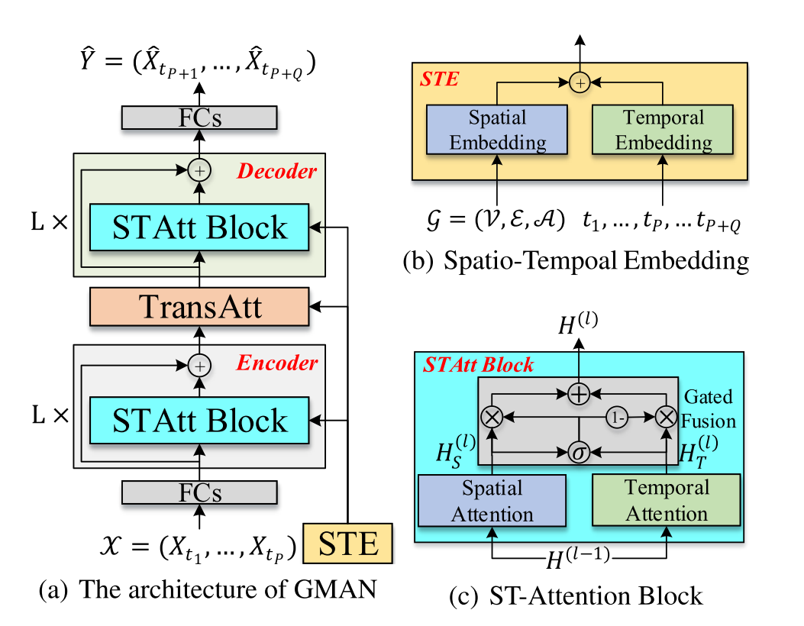
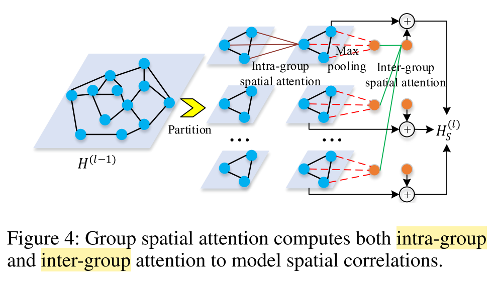
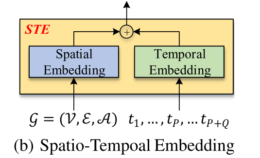

> explore more.

# Traffic Prediction II

最近又看了几篇关于交通预测的论文，做一波总结。

## GMAN: A Graph Multi-Attention Network for Traffic Prediction Chuanpan

本文提出了一个叫做GMAN的网络，是一个encoder-decoder结构，在编码和解码之间有一个transform attention layer用来连接以减轻多步预测中的错误积累。整个结构看起来非常平常，因为交通时空预测领域这些都是老手段了，但是在具体结构上有了一些修改，让整个结构的performance提升了。

先来看一下总体结构：

### **ST-Attention Block**

由一个空间注意力机制，一个时间注意力机制，然后再加上一个gated融合机制。

**空间注意力机制**：不同结点对某一结点的权重计算：
$$
hs^{(l)}_{v_i,t_j} = \sum_{v \in \mathcal{V}} \alpha_{v_i, v} \cdot h^{(l-1)}_{v,t_j},
$$
其中，注意力分数之和为1：
$$
\sum_{v \in \mathcal{V}} \alpha_{v_i, v} = 1
$$
为了稳定学习过程，把空间注意力机制扩展为多头注意力机制。拼接 K 个并行的注意力机制，使用不同的全连接映射。当结点数 N很大的时候，时间和内存消耗都会很大，达到 N^2的数量级，所以用组空间注意力(包含组内注意力分数和组间注意力分数)

**时间注意力机制：**把隐藏状态和时空嵌入拼接起来，使用多头注意力计算注意力分数。对于结点 vi，时间步 tj与 t 的相关性定义为：
$$
 u^{(k)}_{t_j,t} = \frac{< f^{(k)}_{t,1}(h^{(l-1)}_{v_i,t_j} \Vert e_{v_i,t_j}), f^{(k)}_{t,2}(h^{(l-1)}_{v_i,t} \Vert e_{v_i,t}) >}{\sqrt{d}},
$$
**门融合机制：**自适应地融合空间和时间表示。
$$
 H^{(l)} = z \odot H^{(l)}_S + (1 - z) \odot H^{(l)}_T,
$$

$$
z = \sigma(H^{(l)}_S \mathbf{W}_{z,1} + H^{(l)}_T \mathbf{W}_{z,2} + \mathbf{b}_z),
$$

### **Spatio-Temporal Embedding**

向量嵌入节点来保存图结构(node2vec)，为空间嵌入；由于这样的嵌入是固定的所以就提出了把每个时间步编码到向量里，为时间嵌入。

